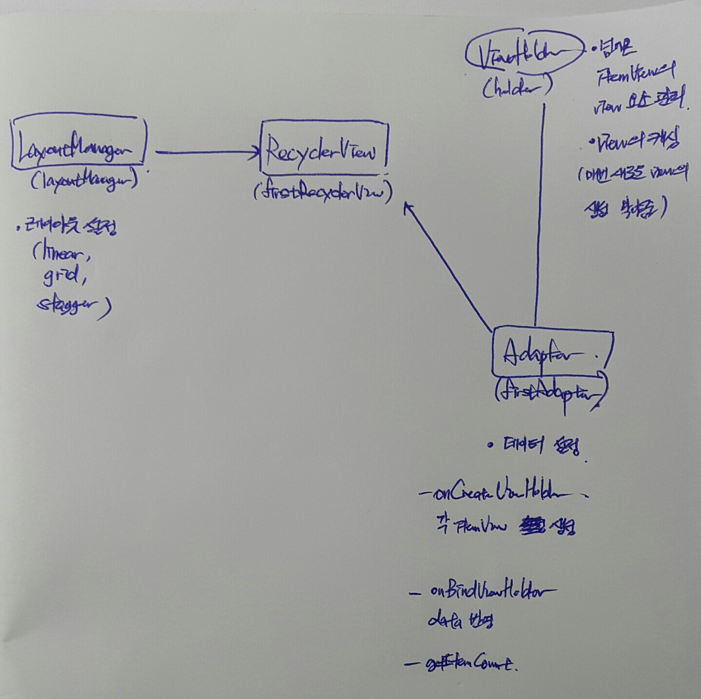

**6. 안드로이드 뷰 컨테이너 살펴보기**
==

- 스크롤뷰
- 수평 스크롤뷰
> 스크롤뷰,  수평 스크롤뷰는 한 개의 뷰만 포함할수 있다.
> 
- 뷰페이저

```

<android.support.design.widget.TabLayout
    android:id="@+id/vp_tab">

    <android.support.design.widget.TabItem
        />

    <android.support.design.widget.TabItem
       />

    <android.support.design.widget.TabItem
        />

</android.support.design.widget.TabLayout>


</android.support.design.widget.AppBarLayout>

<android.support.v4.view.ViewPager
	android:id="@+id/vp">
</android.support.v4.view.ViewPager>
```
> ViewPager는 TabLayout과 Viewpager로 구성
```


tabLayout = (TabLayout) findViewById(R.id.vp_tab);
tabLayout.setTabGravity(TabLayout.GRAVITY_FILL);//menu item의 정렬

vp = (ViewPager)findViewById(R.id.vp);
vp.requestFocus();
vp.setAdapter(new TabPagerAdapter(getSupportFragmentManager(),tabLayout.getTabCount()));
```
> ViewPager에는 TabPagerAdapter  (fragment연동)
``` 

//page swipe시 tab 변경(tablayout의 action 그대로)
vp.addOnPageChangeListener(new TabLayout.TabLayoutOnPageChangeListener(tabLayout));

//tab클릭시 page변경
tabLayout.addOnTabSelectedListener(new TabLayout.OnTabSelectedListener() {

            @Override
            public void onTabSelected(TabLayout.Tab tab) {
                int position = tab.getPosition();
                vp.setCurrentItem(position);
                switch(position){
                    case 0:                       tabLayout.getTabAt(position).setIcon(R.drawable.ic_3bar_blue);
                        break;
                
                }

            }

            @Override
            public void onTabUnselected(TabLayout.Tab tab) {
            }

            @Override
            public void onTabReselected(TabLayout.Tab tab) {

            }
        });
```
> tab클릭시 menuItem변경, viewpager index설정
``` 

    class TabPagerAdapter extends FragmentStatePagerAdapter {

        // Count number of tabs
        private int tabCount;

        public TabPagerAdapter(FragmentManager fm, int tabCount) {
                super(fm);
                this.tabCount = tabCount;
        }

        @Override
        public Fragment getItem(int position) {

                // Returning the current tabs
                switch (position) {
                    case 0:
                        return  new Main_frag_first();
                    case 1:
                       return new Main_frag_second();
                    case 2:
                        return new Main_frag_third();
                    default:
                        return null;
                    }
                }

        @Override
        public int getCount() {
            return tabCount;
        }
    }
```
> getItem함수를 사용하여 해당 index fragment를 return

- 타임피커
- 데이트피커

```
 <TimePicker
        android:timePickerMode="spinner"/>
     
 <DatePicker
     android:id="@+id/datePicker"
     android:layout_width="match_parent"
     android:layout_height="wrap_content"
     android:datePickerMode="calendar"/>
```
> **TimePicker** : spinner, clock(원형) 모드 설정
> **DatePicker** : spinner, calendar(달력) 모드 설정
 
```
timePicker.setOnTimeChangedListener(new TimePicker.OnTimeChangedListener() {
            @Override
            public void onTimeChanged(TimePicker view, int hourOfDay, int minute) {
                tv.setText(hourOfDay+"시"+minute);
            }
        });
        

datePicker.init(2017, 7, 6, new DatePicker.OnDateChangedListener() {
            @Override
            public void onDateChanged(DatePicker view, int year, int monthOfYear, int dayOfMonth) {
                tv.setText(year+"년"+monthOfYear+"월"+dayOfMonth+"일");
            }
        });
```
> onTimeChangedListener > hourOfDay, minute 넘어옴
> datePicker는 init을 통해 default 설정 해줘야함. 이후 onDateChanged > y,m,d 넘어옴

- 리사이클러뷰


```
//LayoutManager 설정, 이걸로 레이아웃 모드 변경가능
        layoutManager = new StaggeredGridLayoutManager(1,StaggeredGridLayoutManager.VERTICAL);
        //MyAdapter 설정, 데이터 반영
        firstAdapter = new MyAdapter(getActivity().getApplicationContext(),fb);

        //RecyclerView view 설정
        firstRecyclerView = (RecyclerView)layout.findViewById(R.id.rv);
        firstRecyclerView.setHasFixedSize(true);
        firstRecyclerView.setNestedScrollingEnabled(false);
        firstRecyclerView.setLayoutManager(layoutManager); // layoutMgr >> recyclerview
        firstRecyclerView.setAdapter(firstAdapter); //adpater >> recyclerview
```
```

public class MyAdapter extends RecyclerView.Adapter<MyAdapter.MyViewHolder> {


    public MyAdapter(FacebookItem[] fb) {
        this.fb = fb;
        itemCount = fb.length;
    }

    //viewtype에 따라 각 item의 view를 생성함
    @Override
    public MyViewHolder onCreateViewHolder(ViewGroup viewGroup, int viewType) {
        Context context = viewGroup.getContext();
        int layoutIdForListItem = R.layout.item_view;
        LayoutInflater inflater = LayoutInflater.from(context);
        boolean shouldAttachToParentImmediately = false;
        View view = inflater.inflate(layoutIdForListItem, viewGroup, shouldAttachToParentImmediately);//3번째 param은 뭐지?


        return new MyViewHolder(view);
    }

    //각 item에 data반영
    @Override
    public void onBindViewHolder(MyViewHolder holder, int position) {

        holder.tv1.setText((fb[position].getT1()));
       
    }

    @Override
    public int getItemCount() {
        return itemCount;
    }


    //Viewholder class. 각 item 설정
    public class MyViewHolder extends RecyclerView.ViewHolder implements View.OnClickListener {


        public MyViewHolder(View view) {
            super(view);
            tv1 = (TextView) view.findViewById(R.id.textView1);
          
        }

        @Override
        public void onClick(View view) {
            
        }
    }
}
```
> **LayoutManager **: 레이아웃 설정
> **Adapter **: ViewHolder를 통해 view생성, data설정
> **ViewHolder **: view의 캐싱(매 item마다 findView하지않고 재활용)
