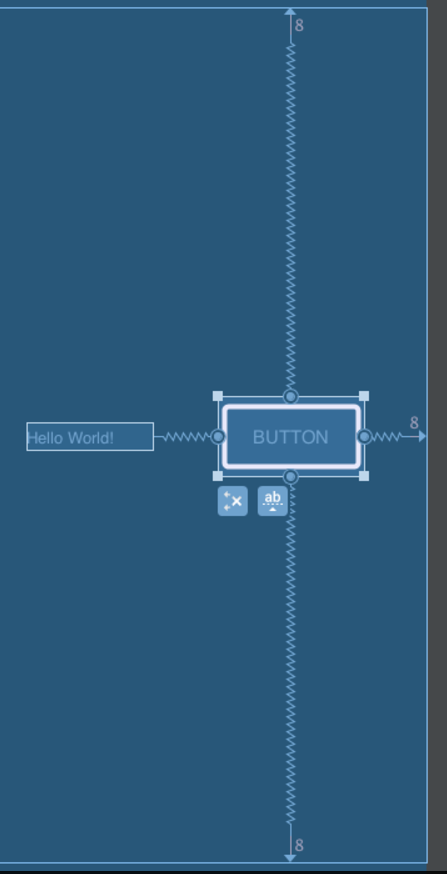

**7. 안드로이드 레이아웃 살펴보기**
==


- 리니어 레이아웃

>orientation 방향대로 쌓임
>> **orientation** : 
- horizontal : 가로 방향으로 쌓임
- vertical : 세로 방향으로 쌓임
**weight** :
- horizontal + width="0dp" >> 가로로 weight비율대로 분배됨


- 릴레티브 레이아웃

>다른 view를 기준으로 쌓임
>>parent 기준 :
- layout_alignParentLeft/Top/ ... 
view 기준 : 
- layout_below/above/toRightof/ ... 

- 프레임 레이아웃

>절대적 위치
>> - visibility :
>visible, invisible 속성을 많이 쓰는듯

- 컨스트레인트 레이아웃


>http://developer88.tistory.com/82
>relativeLayout과 매우 유사
>handle, bias 개념을 이용하여 유동적으로 배치가능

- 퍼센트 레이아웃

>parent기준, %로 height,width,margin,padding 등 설정
```

        <android.support.percent.PercentRelativeLayout
            android:layout_width="0dp"
            android:layout_height="0dp"
            
            app:layout_heightPercent="40%"
            app:layout_widthPercent="40%"
             
            app:layout_marginLeftPercent="10%"
            app:layout_marginTopPercent="10%"
           
            android:layout_alignParentLeft="true"
            android:layout_alignParentTop="true"
           />
```
